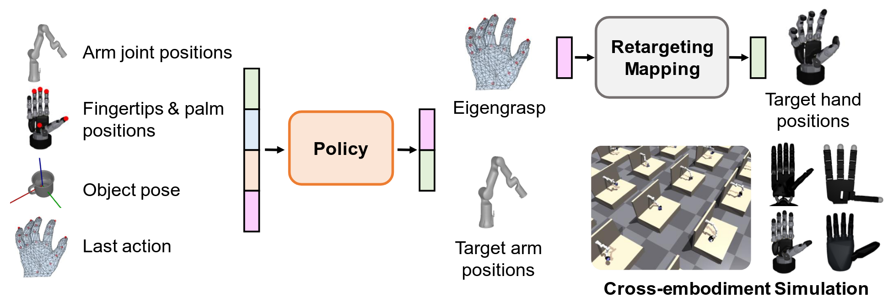

# CrossDex
Official code for **"Cross-Embodiment Dexterous Grasping with Reinforcement Learning"** *(ICLR 2025)*

<div align="center">

[[Website]](https://sites.google.com/view/crossdex/)
[[Paper]](https://openreview.net/forum?id=twIPSx9qHn) 
[[Arxiv]](https://arxiv.org/abs/2410.02479)
______________________________________________________________________

</div>

## TODO List
- [x] Code for processing eigengrasps and training retargeting networks.
- [x] Code for embodiment randomization.
- [x] Code for RL and DAgger.

## Requirements
- Use python 3.8.19. `pip install -r requirements.txt`.
- Install [IsaacGym Preview 4](https://developer.nvidia.com/isaac-gym) and [IsaacGymEnvs](https://github.com/isaac-sim/IsaacGymEnvs).
- Install [manopth](https://github.com/hassony2/manopth).
- Install `dex-retargeting`: download our modified code [dex-retargeting.zip](https://drive.google.com/drive/folders/1I32LoFB8x_Kw6z6AQkyg1KhkJyGnBybZ?usp=drive_link) and unzip. `cd dex-retargeting & pip install -e .`. The code is developed on [this codebase](https://github.com/dexsuite/dex-retargeting/).


## Eigengrasp
Files `results/pca_$N_grab.pkl` are eigengrasps with $N PCA eigen vectors processed from the [GRAB dataset](https://github.com/otaheri/GRAB). Data format in each .pkl is:
```
'eigen_vectors': (N,45) numpy array, the eigengrasps corresponding to 45-dim finger axis-angles in Mano
'min_values': (N,) numpy array, min values on each axis
'max_values': (N,) numpy array, max values on each axis
'D_mean': (45,) numpy array, mean of the original data
'D_std': (45,) numpy array, std of the original data
```
Run `results/vis_pca_data.py` to control the 9-dim coordinates and visualize the corresponding Mano hand pose. 


## Hand Retargeting
We use dexpilot to retarget Mano pose to dexterous hand joint angles. `cd retargeting` and run `vis_eigengrasp_to_dexhand.py` to visualize Mano-to-any-hand retargeting.

To accelerate batch computation for parallel RL training, we train retargeting neural networks. 
- Download GRAB dataset files [GRAB.zip](https://drive.google.com/drive/folders/1I32LoFB8x_Kw6z6AQkyg1KhkJyGnBybZ?usp=drive_link), place `s1.pkl`~`s10.pkl` files under `GRAB/hand_dataset/`. Run `generate_dataset.py` to generate paired training data of 45-dim mano pose and X-dim robot pose. Dataset saved in `dataset/`. Use the option `--robot_name` to specify the robot hand.
- Run `train_retartgeting_nn.py` to train the retargeting neural network. Use `--robot_name` to specify the hand. The checkpoint, config, tensorboard log will be saved in `models/`.
- Run `vis_nn_retargeting.py` to qualitatively check the performance of the learned model.


## Policy Learning

### Use Robot Randomization
- Download meshes [meshes.zip](https://drive.google.com/drive/folders/1I32LoFB8x_Kw6z6AQkyg1KhkJyGnBybZ?usp=drive_link) and unzip. Move the folder `meshes` to `robot_randomization/`.
- In `robot_randomization/`, run `create_random_robots.py` to randomize the xyz offsets of the hand-arm mounting joint, generating 20 variants for each robot.

### Cross-Embodiment Reinforcement Learning

- Download YCB objects [ycb_assets.zip](https://drive.google.com/drive/folders/1I32LoFB8x_Kw6z6AQkyg1KhkJyGnBybZ?usp=drive_link), unzip it, and move the folder `ycb_assets` to `assets/`.

- `cd rl/`, follow the scripts in `run.sh` to train a state-based policy on four types of hands for one object. For example, run 
```
python run_ppo_multidex.py \
num_envs=8192 \
task=MultiDexGrasp \
train.params.max_iterations=40000 \
task.env.observationType="armdof+keypts+objpose+lastact" \
task.env.asset.objectAssetFile="ycb_assets/urdf/077_rubiks_cube.urdf" \
task.env.randomizeRobot=True 
```

### Vision-Based Distillation 
- Generate config file for expert policies: `cd rl/`. Assuming checkpoint directories for all objects are placed under `runs_multidex/`, run `python generate_expert_yaml.py --path runs_multidex`. The generated config file is `expert.yaml`, its format should be:
```
004_sugar_box:
  ckpt: model_40000.pt
  path: runs_multidex/004_sugar_box_2024-09-03_11-40-07
005_tomato_soup_can:
  ckpt: model_40000.pt
  path: runs_multidex/005_tomato_soup_can_2024-09-03_11-40-28
......
```
Move `expert.yaml` to `tasks_crossdex/expert/`.
- Follow the scripts in `run.sh` to train on four types of hands for all objects. For example, run 
```
python run_dagger_multidex.py \
num_envs=16384 \
task=MultiDexGrasp \
train=MultiDexGraspDAGGER \
task.env.enablePointCloud=True \
task.env.observationType="armdof+keypts+objpose+lastact" \
task.env.studentObservationType="armdof+keypts+lastact+objpcl" \
task.env.multiTask=True \
task.env.multiTaskLabel="no" \
task.env.asset.objectAssetDir="ycb_assets/urdf" \
expert=expert \
train.params.max_iterations=20000 \
task.env.randomizeRobot=True 
```

## Citation
```bibtex
@article{yuan2024cross,
  title={Cross-embodiment dexterous grasping with reinforcement learning},
  author={Yuan, Haoqi and Zhou, Bohan and Fu, Yuhui and Lu, Zongqing},
  journal={arXiv preprint arXiv:2410.02479},
  year={2024}
}
```
